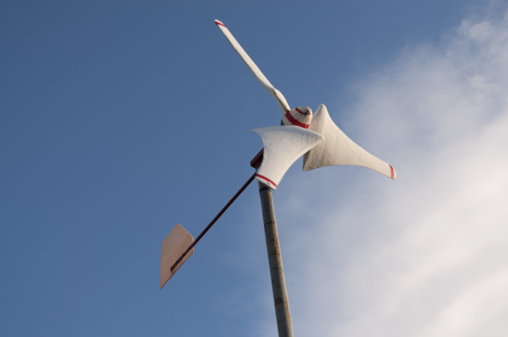
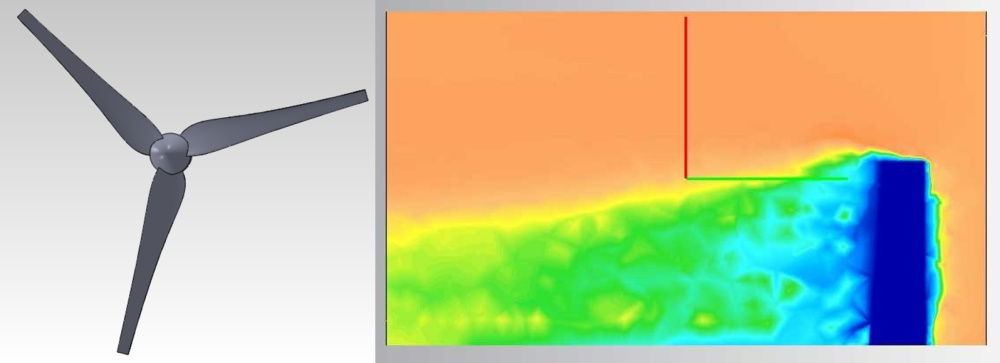

Český popis k nalezení níže.

# Design of a Small Wind Turbine

This is a backup of my high school project created back in 2012. It is a direct
copy, without any modification. Because I was stupid when I was a kid, the
source is quite messy.

I explore aerodynamics principles of wind turbines in this thesis and based on
these principles I design a small turbine width diameter 2.5 meters. I discuss
aspects of its efficiency, startability and ways to reduce induced loss. The
induced losses were explored by a FEM simulation.

The whole thesis in Czech, but even though you might want to check out the [final
version](text_v2/final.pdf) - there are lots of images and a nice formulas! The
thesis won a 2nd place in [SOČ](http://soc.cz).

Small note: Three years later I build a turbine according design in this theses.
However there are no photos, as my SD card with them died. Since then, I backup!
(and you should too).

# Návrh malé větrné turbíny

Tento repozitář je záložní kopií mého středoškolského projektu z roku 2012.
Projekt nebyl nijak modifikován a je v původní (lehce chaotické) verzi.

Práce se zabývá aerodynamikou malých větrných turbín a zejména jejich návrhem.
Popisuje návrh malé horizontální větrné turbíny o průměru 2,5 m. Zkoumá různé
aspekty její účinnosti, zabývá se její startovatelností a omezením indukovaných
ztrát. Práce dále popisuje také stavbu druhé menší turbíny založené na
zjednodušeném výpočtu.

Práce vyhrála 2. místo na [SOČ](http://soc.cz). Finální verze textu je k
nalezení [zde](text_v2/final.pdf).

Poznámka na závěr: Tři roky po napsání této práce jsem skutečně postavil turbínu
popisovou v této práci. Bohužel k ní nemám žádnou dokumentaci, jelikož SD karta
s veškerými fotografiemi umřela. Od té doby zálohuji!
